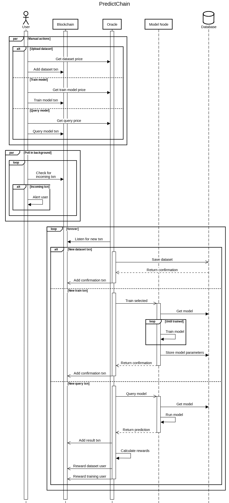

# PredictChain

PredictChain is a marketplace for predictive AI models. Our goal is to make predictive models
more accessible to more potential users.  We do this through the ease of use and transparency
of PredictChain.  Users will be able to upload datasets, request the training of predictive 
models, or submit queries to those models.  These various models will be operated by a central 
node or nodes with computing resources available. 

A variety of models will be made available, ranging from cheap, fast, and simple to more expensive, 
slower, and more powerful. This will allow for a large variety of predictive abilities for both 
simple and complex patterns. All the past transactions will be stored on the blockchain for public viewing.  
These include dataset creation, model training, model queries, and the results of these queries.

## Quick Start

For each of the following cases, they will involve setting up a relevant environment then running both
the *Client* and *Oracle* nodes.

First, clone this repository and enter its directory.

```bash
git clone https://github.com/AI-and-Blockchain/S23_PredictChain # Clone the repository
cd S23_PredictChain # Enter its directory
```

> **_NOTE:_** All commands must be run from the root project directory unless otherwise specified.

There are two primary methods of building and running the project:

### Running From Source

The following should work on all platforms.  

> **_NOTE:_** If using a python virtual environment, make sure all python commands are run within that environment.

#### Prerequisite Software

Before running the program, the following software must be available.  Once the main software is installed,
the instructions below will detail how to install the dependencies.

* Python 3.10 or above
  * Dependencies (from [requirements.txt](requirements.txt)):
    * pyteal: 0.24.0
    * py-algorand-sdk: 2.1.2
    * flask: 2.2.3
    * requests: 2.28.2
    * torch: 2.0.0
    * redis: 4.5.4
    * web3storage: 0.1.1
    * beautifulsoup4: 4.12.2
    * pandas: 2.0.0
    * flask-cors: 3.0.10
    * sphinx: 6.1.3
    * matplotlib: 3.7.1
  
* NodeJs 12.22.9 (NPM v8.5.1) or above
  * Dependencies (from [package.json](client/predict-chain-ui/package.json)):
    * axios: ^1.3.4
    * firebase: ^9.19.1
    * react: ^18.2.0
    * react-dom: ^18.2.0
    * react-firebase-hooks: ^5.1.1
    * react-router-dom: ^6.10.0
    * react-scripts: 5.0.1
    * web-vitals: ^2.1.4

The following software is recommended:

* Redis 6.0.16 or above

> **_NOTE:_** Redis is not required for this program to run, but is recommended.  Without it, a special
> compatability layer will be activated that will use a dictionary instead.  **This dictionary will not persist between runs!**

> **_NOTE:_** Redis does not directly support running on windows.  To install on Windows, install through
> the Windows Subsystem for Linux (WSL), making sure the database has started before program execution.

First, install the project dependencies using

```bash
pip install -r requirements.txt
```
```bash
cd client/predict-chain-ui # Enter react front end directory
npm i
cd ../.. # Return to the root directory
```

> **_NOTE:_** Before running either node, make sure the credential files have been filled out.
> More information fan be found in the [Credentials Readme](creds/readme.md).

Next, run the client and oracle programs.  This should be done within separate terminals as both
processes are continuous and do not exit while the network is running.

```bash
python clientMain.py
``` 
and 
```bash
python oracleMain.py
```

After these have been run, the web interface should be running on [localhost:3000](http://localhost:3000).

Additionally, working examples of the three core parts of the project are available in [sandbox.py](sandbox.py).
Simply comment or uncomment the desired actions inside the `sandbox()` function.  Leave all three uncommented for
a complete, working example.

### Docker

If using Linux, building and running docker containers for the program is the most straightforward
method of setting up the nodes.

> **_NOTE:_** Before building the container, make sure the credential files have been filled out.
> More information fan be found in the [Credentials Readme](creds/readme.md).

First, build the container using:

```bash
docker/buildContainer.sh
```

Next, run both the client and oracle programs using:

```bash
docker/runClient.sh
``` 
and 
```bash
docker/runOracle.sh
```

After these containers have been run, the web interface should be running on [localhost:3000](http://localhost:3000).

## User Actions

Users can interact with this system through a variety of ways.  Users can choose to upload datasets
of their own, train one of the base models on any previously uploaded dataset, or query any of the
trained models for a specific result.

## Model Classes

There will be several types of models available for use.  These include:

- Multi-layered Perceptrons
- Recurrent Neural Networks
- Long Short-term Memory Networks
- Gated Recurrent Unit Networks

The capabilities of these different methods varies greatly.  To save on costs, users with simple
classification tasks can opt for models that are cheaper, but will still provide good results.
Alternatively, users looking to analyze more complex relations can select the more complex models
at a higher cost.  Users are incentivized to balance cost and performance as they will be rewarded
for better performing models.

## The Oracle

The oracle is a privileged node that helps the blockchain keep up to date with the outside world.
It can help get information out of the blockchain and to a programmatic API, or it can gather 
information from the outside world and inject it back into the blockchain.  For example, it would
listen for the outcomes of user-predicted events, return those results to the users, and update
those who submitted the dataset.

Communication between the blockchain and the oracle is facilitated by transactions.  When a message
needs to be sent between the two parties, the sending party creates a transaction with a note attached.
This note contains a JSON-encoded form of the arguments for the operation being requested.  These 
arguments are then received and interpreted by the target of the transaction.  Using this form for communication
ensures an unbroken, public record of all of PredictChain's functions.

## Payments and Incentives

Payments and incentives help to turn this project into a functioning system.  They are each calculated
using a fixed equation that is open to all users to view.  Each reward and incentive is also subject to
a multiplier.  This can be raised or lowered by the oracle at any point.  To ensure there is a
constant log kept in the blockchain, the id of this modifying transaction will be saved and returned
to any user upon request.

### Payments
- Any user will be able to query previously trained models for predictions of real-world events.
Each time this is done, these users will make a small payment to the system.  This fee is based off
of the complexity of the requested model.

- Users who upload their own datasets will also have to pay a small fee.  This fee is based off of
the size of the dataset that they plan to upload.

 - Users who choose to request that a base model be trained on a particular dataset will also be
charged with a small fee.  This fee is based off of a variety of factors including the complexity
of the model and the size of the dataset.

### Incentives

To compensate for the payments that users make to the system, they will also be rewarded in the right
circumstances.  Each of the below events are triggers when a user queries the model for some event.

- Dataset uploading users will be rewarded both when a model is trained on their dataset and when
that trained model makes a correct prediction.

- Model training users will be rewarded whenever their model makes a correct prediction.


## Diagrams

### Sequence Diagram



### Use Case Diagram


## User Interface


