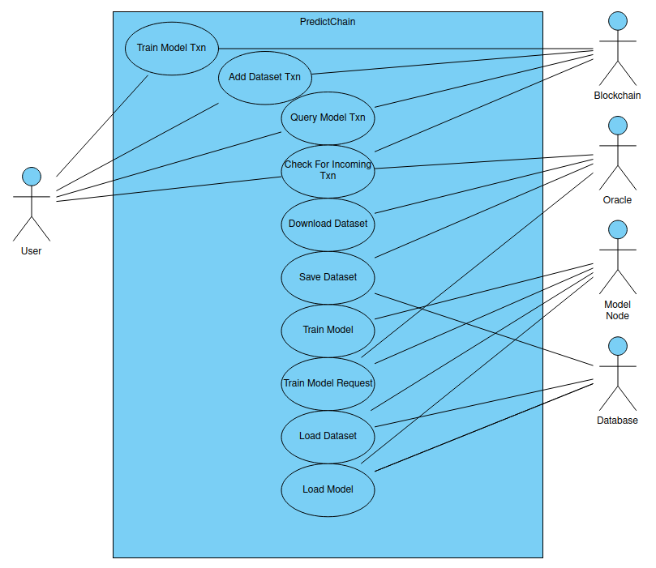

# PredictChain

PredictChain is a marketplace for predictive AI models. Users will be able to upload datasets
to train predictive models, or submit queries to those models.  These various models will be 
operated by a central node or nodes with computing resources available. A variety of models will be 
made available, ranging from cheap, fast, and simple to more expensive, slower, and more powerful. 
This will allow for a large variety of predictive abilities for both simple and complex patterns.
All the past predictions form these models will be stored on the blockchain for public viewing.

## Model Classes

There will be several types of models available for use.  These may include:

- Decision Trees
- Bayesian Networks
- Perceptrons
- Linear Neural Networks
- Recurrent Neural Networks

The capabilities of these different methods varies greatly.  To save on costs, users with simple
classification tasks can opt for models that are cheaper, but will still provide good results.
Alternatively, users looking to analyze more complex relations can select the more complex models
at a higher cost.  Users are incentivized to balance cost and performance as they will be rewarded
for better performing models.

## The Oracle

The oracle is a privileged node that helps the blockchain keep up to date with the outside world.
It can help get information out of the blockchain and to a programmatic API, or it can gather 
information from the outside world and inject it back into the blockchain.  For example, it would
listen for the outcomes of user-predicted events and return those results to the users and update
those who submitted the dataset.

## Payments and Incentives

Any user will be able to query previously trained models for predictions of real-world events.
Each time this is done, these users will make a small payment to the system.

Users who upload datasets will be able to choose which class of model that their dataset will be
trained on.  The more complex models will be more expensive than their simpler counterparts.
In order to compensate for this, these users will be compensated whenever their model makes a correct
prediction.

## Betting

In addition to the other uses of this project, users may also be able to bet on the outcomes of events.
Betting users would stake some amount on one of the possible outcomes of an event or the predictions
of the model.  Winning users will be rewarded with their original stake in addition to part of the
stake of any incorrect users.

## User Interface

## Diagrams

### Sequence Diagram

### Use Case Diagram

